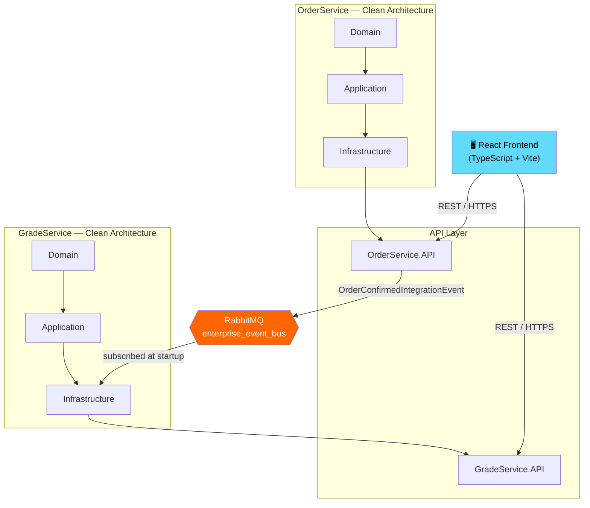
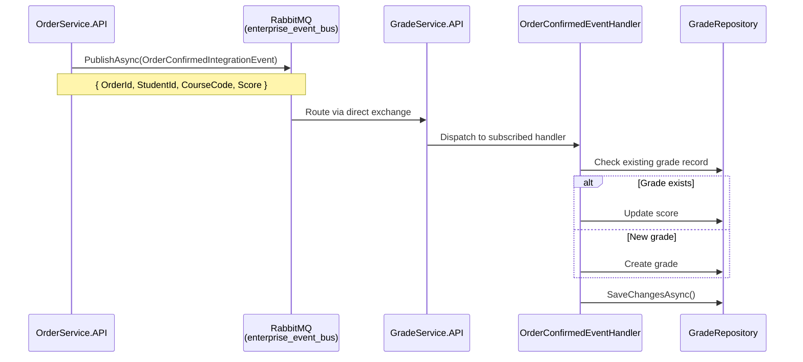

<div align="center">

# 🎓 Grade Monitoring & Observability Platform

**A production-style microservices platform demonstrating Clean Architecture, event-driven design, and full-stack observability — built with .NET 9 and React.**

[](https://dotnet.microsoft.com/)
[](https://react.dev/)
[](https://www.typescriptlang.org/)
[](https://www.rabbitmq.com/)
[](https://www.docker.com/)
[](https://kubernetes.io/)
[](#license)

[Architecture](#-architecture-overview) •
[Tech Stack](#-tech-stack) •
[Services](#-services) •
[Getting Started](#-getting-started) •
[Observability](#-observability) •
[Roadmap](#-roadmap)

</div>

---

## 🔗 Live Demo

| Service | URL |
|---|---|
| 🖥️ **Frontend** | [grade-monitoring-frontend2.onrender.com](https://grade-monitoring-frontend2.onrender.com) |

> ⏳ Hosted on Render's free tier — the instance spins down after inactivity, so the first request may take 30–50 seconds to wake up.
>
> The backend services (`OrderService`, `GradeService`) are deployed and running behind the frontend; see [Architecture Overview](#-architecture-overview) for details.

---

## 📖 Overview

This platform simulates a real-world **academic grade tracking system** split into independent microservices that communicate asynchronously over **RabbitMQ**. It's built to showcase:

- ✅ **Clean Architecture** (Domain → Application → Infrastructure → API) applied consistently across services
- ✅ **Event-driven communication** between services using an integration event bus
- ✅ **Shared cross-cutting libraries** (`BuildingBlocks`) for events, observability, and common primitives
- ✅ **Containerized & orchestrated deployment** via Docker, Kubernetes, and Helm
- ✅ **Full observability stack** — metrics, logs, and traces wired through Prometheus, Grafana, Loki, Tempo, and OpenTelemetry
- ✅ **CI/CD automation** with GitHub Actions

> 💡 This is a portfolio/learning project intended to demonstrate enterprise-grade .NET + React architecture patterns, not a production deployment.

---

## 🏗 Architecture Overview

Each microservice follows **Clean Architecture**, with shared concerns (event bus, observability, common utilities) factored out into `BuildingBlocks` libraries consumed by every service.



**Why this matters:** the two services never call each other directly. `OrderService` publishes a fact ("an order was confirmed"); `GradeService` reacts to it independently. This keeps services deployable, scalable, and testable in isolation — a pattern used widely in real distributed systems.

---

## 🗂 Project Structure

<details>

```
GradeMonitoringObservabilityPlatform22/
│
├── src/
│   ├── frontend/                      # React + TypeScript + Vite SPA
│   │   └── src/
│   │       ├── app/                   # App entry, routing
│   │       ├── assets/                # Global styles (Tailwind directives)
│   │       ├── components/            # Reusable UI components
│   │       ├── features/              # Feature-sliced modules
│   │       ├── hooks/                 # Custom React hooks
│   │       ├── services/              # API clients (axios)
│   │       ├── store/                 # Zustand state stores
│   │       ├── types/                 # Shared TypeScript types
│   │       └── utils/                 # Helper functions
│   │
│   └── services/
│       ├── BuildingBlocks/
│       │   ├── Common/                # Shared domain primitives, exceptions, pagination
│       │   ├── EventBus/              # RabbitMQ-based event bus abstraction
│       │   │   ├── Abstractions/      # IEventBus, IIntegrationEventHandler
│       │   │   ├── Events/            # IntegrationEvent base class
│       │   │   ├── IntegrationEvents/ # Shared cross-service events
│       │   │   └── RabbitMQ/          # RabbitMQEventBus implementation
│       │   └── Observability/         # Logging, Metrics, Tracing extensions
│       │
│       ├── OrderService/              # Microservice #1
│       │   ├── OrderService.Domain
│       │   ├── OrderService.Application
│       │   ├── OrderService.Infrastructure
│       │   ├── OrderService.API       # Publishes OrderConfirmedIntegrationEvent
│       │   └── tests/                 # Unit, Integration, Functional
│       │
│       └── GradeService/              # Microservice #2
│           ├── src/
│           │   ├── GradeService.Domain
│           │   ├── GradeService.Application
│           │   ├── GradeService.Infrastructure
│           │   │   └── EventHandlers/ # OrderConfirmedEventHandler
│           │   └── GradeService.API
│           └── tests/                 # Unit, Integration, Functional
│
├── deploy/
│   ├── docker/                        # Dockerfiles + prod compose
│   ├── k8s/                           # Namespaces, deployments, services, ingress, HPA
│   ├── helm/enterprise-platform/      # Helm chart (dev/prod values)
│   └── monitoring/
│       ├── prometheus/  ├── grafana/  ├── loki/
│       └── tempo/       └── otel-collector/  alertmanager/
│
├── .github/workflows/
│   ├── frontend-ci.yml                # Build frontend on push/PR
│   ├── backend-ci.yml                 # Restore/build/test .NET solution
│   └── deploy.yml                     # Build & push images, deploy to k8s
│
└── docs/
    ├── architecture/  ├── api/  └── runbooks/
```

</details>

---

## 🛠 Tech Stack

| Layer | Technology |
|---|---|
| **Backend** | .NET 9, ASP.NET Core Web API, Clean Architecture, MediatR, FluentValidation, AutoMapper, EF Core |
| **Messaging** | RabbitMQ.Client 7.x (async API) |
| **Frontend** | React 18.2, TypeScript 5.2, Vite 5.1, TanStack Query 5.17, Zustand 4.5, Tailwind CSS 3.4 |
| **UI / Charts** | lucide-react 0.323, Recharts 2.10 |
| **Observability** | Prometheus, Grafana, Loki, Tempo, OpenTelemetry Collector, Alertmanager |
| **Containerization** | Docker, Docker Compose |
| **Orchestration** | Kubernetes, Helm |
| **CI/CD** | GitHub Actions |
| **Testing** | xUnit (Unit / Integration / Functional) |

### 🎨 Frontend Design Notes

- Utility-first **Tailwind CSS** — no separate component CSS files
- System font stack by default (fast load times); see [roadmap](#-roadmap) for a custom typeface upgrade
- Dashboard & Grades pages feature gradient stat cards, colored grade badges (A+/A/B/C), circular score indicators, and Recharts bar/pie charts

---

## ⚙️ Services

### 📦 OrderService

Handles order creation and confirmation. On confirmation, publishes an `OrderConfirmedIntegrationEvent` to notify the rest of the system.

| Layer | Responsibility |
|---|---|
| `OrderService.Domain` | Entities, enums |
| `OrderService.Application` | Use cases (MediatR + FluentValidation + AutoMapper) |
| `OrderService.Infrastructure` | EF Core persistence, repositories, identity |
| `OrderService.API` | REST endpoints; publishes `OrderConfirmedIntegrationEvent` on order confirmation |

### 🎯 GradeService

Listens for order confirmation events and creates/updates a student's grade — a working example of asynchronous, event-driven inter-service communication.

| Layer | Responsibility |
|---|---|
| `GradeService.Domain` | Grade entities |
| `GradeService.Application` | Grade-related use cases |
| `GradeService.Infrastructure` | Persistence + `OrderConfirmedEventHandler` (upserts grade via `IGradeRepository`) |
| `GradeService.API` | REST endpoints + RabbitMQ subscription bootstrap |

---

## 🔄 Event-Driven Communication

A shared `BuildingBlocks.EventBus` library wraps RabbitMQ behind a clean abstraction:

```csharp
public interface IEventBus
{
    Task PublishAsync(IntegrationEvent eventData);

    void Subscribe<TIntegrationEvent, TIntegrationEventHandler>()
        where TIntegrationEvent : IntegrationEvent
        where TIntegrationEventHandler : IIntegrationEventHandler<TIntegrationEvent>;

    void Unsubscribe<TIntegrationEvent, TIntegrationEventHandler>()
        where TIntegrationEvent : IntegrationEvent
        where TIntegrationEventHandler : IIntegrationEventHandler<TIntegrationEvent>;
}
```



**Flow summary:**
1. `OrderService` confirms an order and publishes `OrderConfirmedIntegrationEvent` via `_eventBus.PublishAsync(...)`.
2. RabbitMQ routes the message via a direct exchange (`enterprise_event_bus`) to the event's queue.
3. `GradeService.API` subscribes on startup: `eventBus.Subscribe<OrderConfirmedIntegrationEvent, OrderConfirmedEventHandler>();`
4. `OrderConfirmedEventHandler` consumes the event, performs a create-or-update on the grade record, and persists via `SaveChangesAsync()`.

> **Implementation status:** ✅ Fully implemented and verified end-to-end. The event contract, publisher, subscriber, and create-or-update persistence logic are live and tested — both services' test suites pass (OrderService 5/5, GradeService 15/15), and the full publish → consume round-trip has been verified against a live RabbitMQ instance (CloudAMQP) on the deployed Render services.

---

## 🚀 Getting Started

### Prerequisites

- [.NET 9 SDK](https://dotnet.microsoft.com/download)
- [Node.js 20+](https://nodejs.org/)
- [Docker & Docker Compose](https://www.docker.com/)
- RabbitMQ (via Docker Compose or local install)

### Backend

```bash
cd src/services/OrderService
dotnet restore OrderService.sln
dotnet build OrderService.sln

cd ../GradeService
dotnet restore GradeService.sln
dotnet build GradeService.sln
```

### Frontend

```bash
cd src/frontend
npm install
npm run dev
```

### Full Stack (Docker Compose)

```bash
docker-compose up --build
```

---

## 🧪 Building the Project

Both solutions build cleanly with zero errors:

```bash
# OrderService (7 projects: Domain, Application, Infrastructure, API, 3x Tests)
cd src/services/OrderService && dotnet build OrderService.sln

# GradeService (7 projects: Domain, Application, Infrastructure, API, 3x Tests)
cd src/services/GradeService && dotnet build GradeService.sln
```

Frontend build (TypeScript check + Vite production build, with manual chunk-splitting for `react`, `react-query`, `recharts`, `zustand`):

```bash
cd src/frontend && npm run build
```

### ✅ Verified Status (last checked)

| Check | Result |
|---|---|
| `OrderService.sln` build | ✅ 0 errors (4 warnings — AutoMapper advisory, package-level only) |
| `GradeService.sln` build | ✅ 0 errors, 0 warnings |
| OrderService test suite | ✅ 5/5 passing (Unit, Integration, Functional) |
| GradeService test suite | ✅ 15/15 passing (Unit, Integration, Functional) |
| Frontend ESLint (`--max-warnings 0`) | ✅ Passing |
| Frontend `tsc` + Vite build | ✅ Passing |

---

## 📊 Observability

| Tool | Purpose |
|---|---|
| **Prometheus** | Metrics scraping & alerting rules |
| **Grafana** | Dashboards (`deploy/monitoring/grafana/dashboards/api-overview.json` — request rate, error rate, p95 latency, active pods) |
| **Loki** | Log aggregation |
| **Tempo** | Distributed tracing |
| **OpenTelemetry Collector** | Unified telemetry pipeline |
| **Alertmanager** | Alert routing |

---

## 🔁 CI/CD

GitHub Actions workflows under `.github/workflows/`:

| Workflow | Trigger | Purpose |
|---|---|---|
| `frontend-ci.yml` | Push/PR touching `src/frontend/**` | Install deps & build the React app |
| `backend-ci.yml` | Push/PR touching `src/services/**` | Restore, build (Release), and test the OrderService solution |
| `deploy.yml` | Manual / on release | Build & push Docker images to GHCR, deploy to Kubernetes, verify rollout status |

---

## 🗺 Roadmap

- [x] Wire `OrderService` to publish `OrderConfirmedIntegrationEvent` on order confirmation
- [x] Persist actual grade updates in `GradeService` (create-or-update via `IGradeRepository`)
- [x] Verified the RabbitMQ publish → consume flow end-to-end on the live Render deployment
- [x] Run the GradeService test suite (`dotnet test GradeService.sln`)
- [ ] Add an API Gateway (YARP/Ocelot) as a single entry point for the frontend
- [ ] Add JWT-based authentication service
- [ ] Populate Grafana dashboards with live metrics via a local `docker-compose up` run
- [ ] Expand test coverage (handler-level unit tests, integration tests for the event flow)
- [ ] UI polish (see below)

### 🎨 Suggested UI/Design Upgrades

The current UI (Dashboard + Grade Records pages) is clean and functional — gradient stat cards, colored grade badges, bar/pie charts. Planned upgrades to push it toward a more premium feel:

- **Custom typeface** — swap the system font stack for Inter, Geist, or Plus Jakarta Sans
- **Tailwind design tokens** — named color tokens (`primary`, `success`, `warning`, `danger`) instead of ad-hoc utility classes
- **Micro-interactions** — hover/transition states on stat cards and table rows
- **Skeleton loading states** for async data fetches
- **Dark mode** via Tailwind's `dark:` variant, persisted in the Zustand store
- **Empty/error states** for tables and charts when data is unavailable

---

## 📄 License

This project is for **educational/portfolio purposes**.

---

<div align="center">

**Built to demonstrate enterprise-grade architecture patterns in a real, working codebase.**

</div>
