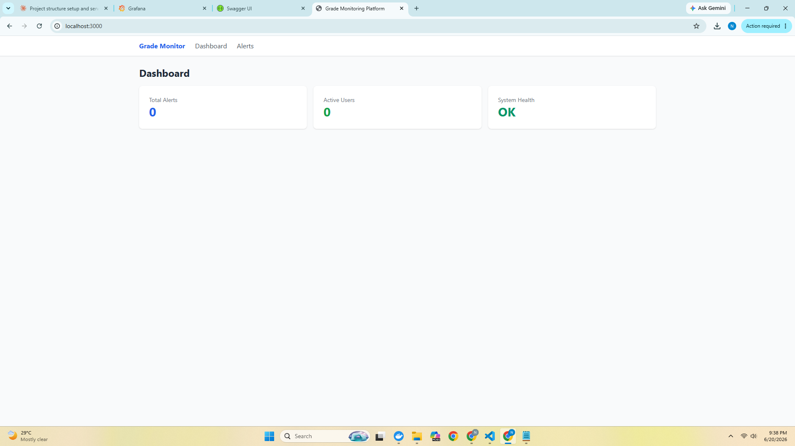
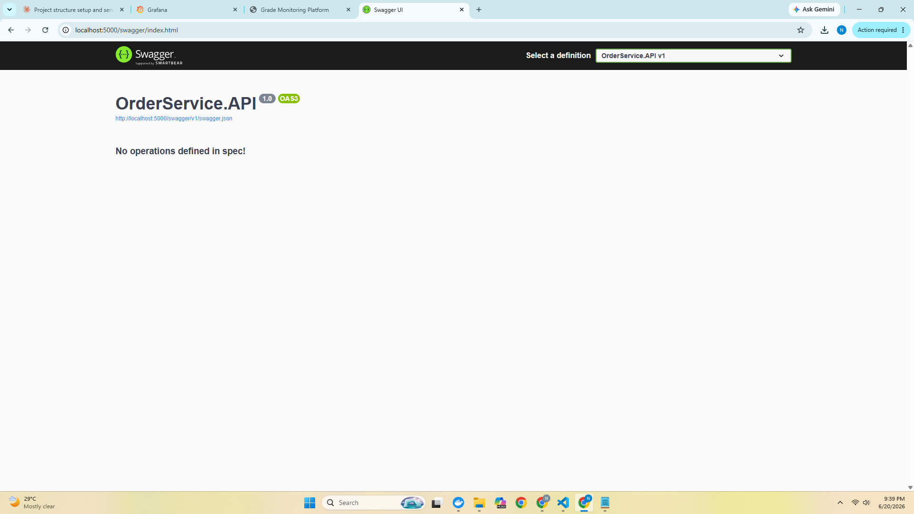
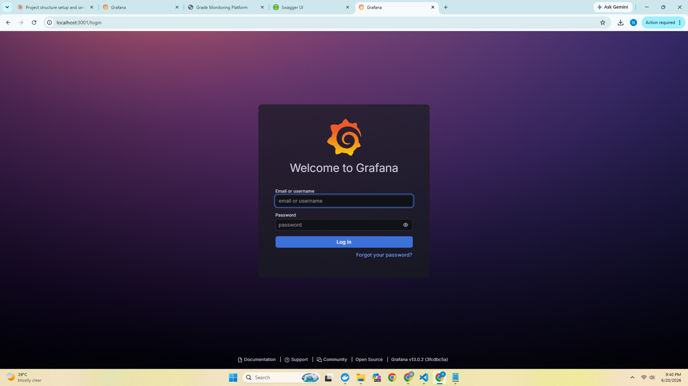
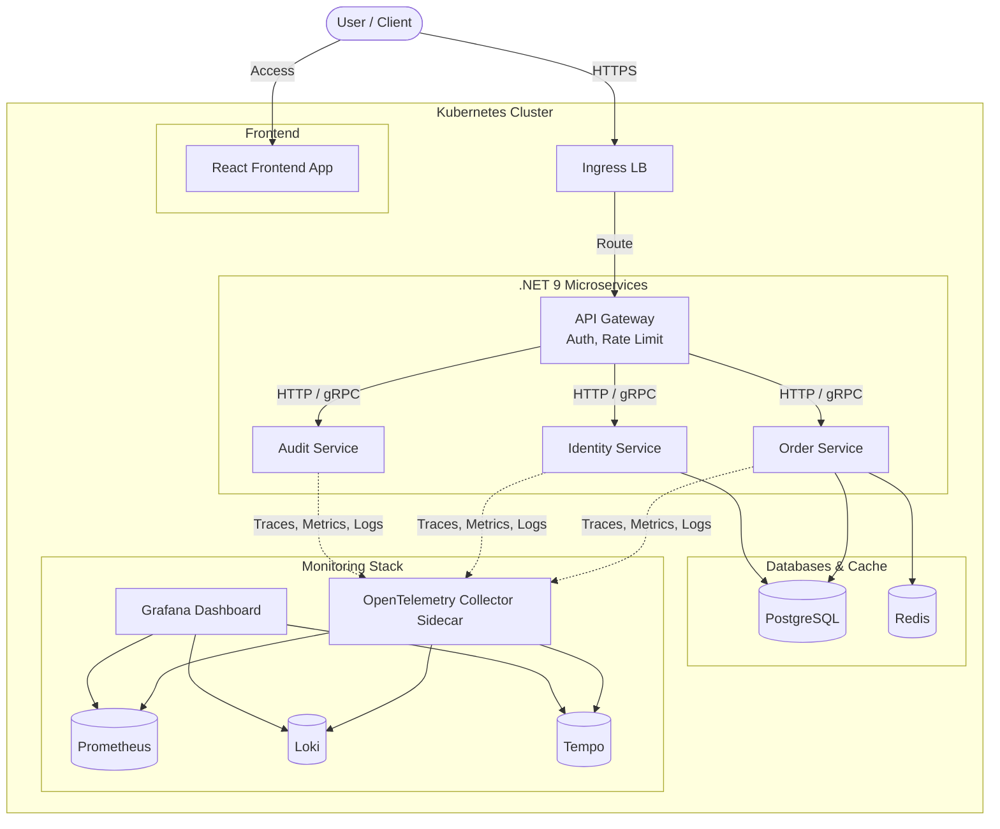

📊 Grade Monitoring & Observability Platform
A microservices-based grade tracking system built with .NET 9 (Clean Architecture) and React, featuring a complete observability stack (Prometheus, Grafana) for real-time monitoring, metrics, and alerting — designed and deployed following enterprise-grade engineering practices.


---
🔗 Live Demo
> 🚧 Live deployment link coming soon — being deployed to a free-tier cloud host.
Service	Link
🌐 Frontend	coming soon
⚙️ API + Swagger	coming soon
📈 Grafana Dashboard	coming soon
---
✨ Overview
This project simulates a real-world enterprise platform for tracking student grades and system health, built to demonstrate:
Clean Architecture in a .NET 9 backend (Domain → Application → Infrastructure → API)
A React + TypeScript frontend consuming a REST API
Full observability: metrics (Prometheus), dashboards/alerts (Grafana), tracing-ready (OpenTelemetry)
Containerized local development via Docker Compose, with Kubernetes & Helm manifests for production deployment
CI/CD pipelines via GitHub Actions
---
🖼️ Screenshots
> _Add screenshots here — see "Capturing Screenshots" section below._
Frontend Dashboard	API Swagger	Grafana Monitoring
		
---
🧰 Tech Stack
Layer	Technology
Frontend	React 18, TypeScript, Vite, TailwindCSS
Backend	.NET 9, ASP.NET Core Web API, EF Core, MediatR (CQRS), FluentValidation
Database	PostgreSQL 16
Auth	JWT Bearer Authentication
Monitoring	Prometheus, Grafana
Observability (planned)	OpenTelemetry, Loki, Tempo
Containerization	Docker, Docker Compose
Orchestration	Kubernetes manifests + Helm charts
CI/CD	GitHub Actions
---
🚀 Quick Start (Local)
Prerequisites
Docker Desktop installed and running
Git
Run the full stack
```bash
git clone https://github.com/niloykumarbarman/Grade-Monitoring-Observability-Platform.git
cd Grade-Monitoring-Observability-Platform

docker-compose up --build -d
```
Access the services
Service	URL
🌐 Frontend	http://localhost:3000
⚙️ API	http://localhost:5000
📖 Swagger	http://localhost:5000/swagger
🗄️ PostgreSQL	localhost:5432
📈 Grafana	http://localhost:3001 (admin / admin)
🔥 Prometheus	http://localhost:9090
Stop the stack
```bash
docker-compose down
```
---
📂 Project Directory Structure
```text
enterprise-platform/
│
├── README.md
├── docker-compose.yml
├── docker-compose.override.yml
├── .gitignore
├── .editorconfig
├── Directory.Build.props
│
├── src/
│   │
│   ├── frontend/                          # React Frontend
│   │   ├── public/
│   │   ├── src/
│   │   │   ├── app/                        # App setup, routing, store
│   │   │   ├── components/                 # Reusable UI components
│   │   │   ├── features/                   # Feature-based modules
│   │   │   ├── hooks/                      # Custom React hooks
│   │   │   ├── services/                   # API clients (axios/fetch)
│   │   │   ├── store/                      # Redux/Zustand state
│   │   │   ├── types/                      # TypeScript types
│   │   │   ├── utils/                      # Helpers
│   │   │   └── assets/                     # Images, styles
│   │   ├── Dockerfile
│   │   ├── nginx.conf
│   │   ├── package.json
│   │   ├── tsconfig.json
│   │   └── vite.config.ts
│   │
│   └── services/                           # .NET 9 Microservices
│       │
│       ├── BuildingBlocks/                  # Shared cross-cutting libraries
│       │   ├── Common/
│       │   ├── EventBus/                     # Message broker abstractions
│       │   └── Observability/                # OpenTelemetry, logging
│       │
│       └── OrderService/                     # Example microservice (repeat per service)
│           ├── src/
│           │   ├── OrderService.Domain/           # ← Domain Layer
│           │   ├── OrderService.Application/       # ← Application Layer
│           │   ├── OrderService.Infrastructure/    # ← Infrastructure Layer
│           │   └── OrderService.API/               # ← Presentation Layer
│           ├── tests/
│           │   ├── OrderService.UnitTests/
│           │   ├── OrderService.IntegrationTests/
│           │   └── OrderService.FunctionalTests/
│           └── Dockerfile
│
├── deploy/
│   │
│   ├── docker/
│   │   ├── Dockerfile.api
│   │   ├── Dockerfile.frontend
│   │   └── docker-compose.prod.yml
│   │
│   ├── k8s/                                 # Kubernetes manifests
│   │   ├── namespaces/
│   │   ├── deployments/
│   │   ├── services/
│   │   ├── ingress/
│   │   ├── configmaps/
│   │   ├── secrets/
│   │   └── hpa/                               # Horizontal Pod Autoscalers
│   │
│   ├── helm/                               # Helm charts
│   │   └── enterprise-platform/
│   │       ├── Chart.yaml
│   │       ├── values.yaml
│   │       ├── values-dev.yaml
│   │       ├── values-prod.yaml
│   │       └── templates/
│   │           ├── deployment.yaml
│   │           ├── service.yaml
│   │           ├── ingress.yaml
│   │           ├── configmap.yaml
│   │           └── _helpers.tpl
│   │
│   └── monitoring/                         # Observability stack configs
│       ├── prometheus/
│       │   ├── prometheus.yml
│       │   └── alert.rules.yml
│       ├── grafana/
│       │   ├── dashboards/
│       │   └── datasources/
│       ├── loki/
│       │   └── loki-config.yml
│       ├── tempo/
│       │   └── tempo-config.yml
│       ├── otel-collector/
│       │   └── otel-collector-config.yml
│       └── alertmanager/
│           └── alertmanager.yml
│
├── .github/
│   └── workflows/                          # CI/CD pipelines
│       ├── frontend-ci.yml
│       ├── backend-ci.yml
│       └── deploy.yml
│
└── docs/
    ├── architecture/
    ├── api/
    └── runbooks/
```
---
🏗️ Clean Architecture Layers (.NET 9 Backend)
Clean Architecture organizes code into concentric layers where dependencies point inward — outer layers depend on inner layers, never the reverse. This is enforced via the Dependency Inversion Principle.
```text
       ┌─────────────────────────────────────┐
       │          API / Presentation         │ ──► Controllers, Minimal APIs
       │   ┌─────────────────────────────┐   │
       │   │        Infrastructure       │   │ ──► EF Core, External Services
       │   │   ┌─────────────────────┐   │   │
       │   │   │     Application     │   │   │ ──► Use Cases, CQRS
       │   │   │   ┌─────────────┐   │   │   │
       │   │   │   │   Domain    │   │   │   │ ──► Entities, Business Rules
       │   │   │   └─────────────┘   │   │   │
       │   │   └─────────────────────┘   │   │
       │   └─────────────────────────────┘   │
       └─────────────────────────────────────┘
                 Dependencies flow INWARD ──►
```
🟢 Domain Layer (`OrderService.Domain`) — The Core
The innermost layer. Has zero dependencies on other layers or frameworks.
Entities — Core business objects (Order, OrderItem)
Value Objects — Immutable concepts (Money, Address)
Domain Events — Things that happened (OrderPlacedEvent)
Aggregates — Consistency boundaries
Domain Exceptions & Enums
Repository Interfaces — Contracts only, no implementation
🔵 Application Layer (`OrderService.Application`)
Orchestrates the business use cases. Depends only on Domain.
Use Cases / Handlers — CQRS with MediatR (CreateOrderCommand, GetOrderQuery)
DTOs — Data transfer objects
Interfaces — Abstractions for infrastructure (IEmailService, IPaymentGateway)
Validation — FluentValidation rules
Behaviors / Pipelines — Logging, validation, transactions
Mapping — AutoMapper profiles
🟠 Infrastructure Layer (`OrderService.Infrastructure`)
Implements the interfaces defined in inner layers. Depends on Application & Domain.
Persistence — EF Core DbContext, migrations, repository implementations
External Services — Email, payment gateways, message brokers
Caching — Redis
Identity — Authentication/authorization providers
Observability — OpenTelemetry instrumentation
🔴 API / Presentation Layer (`OrderService.API`)
The entry point. Depends on all inner layers (typically via Application + Infrastructure DI).
Controllers / Minimal APIs — HTTP endpoints
Middleware — Exception handling, correlation IDs
Dependency Injection — Wiring everything together (Program.cs)
Filters, API Versioning, Swagger/OpenAPI
Health Checks
🔑 Key Principle: The Dependency Rule
```
API ──► Infrastructure ──► Application ──► Domain
          (All arrows point toward Domain)
```
The Domain knows nothing about databases, HTTP, or frameworks. This makes the core business logic testable, framework-independent, and durable even if you swap EF Core for Dapper or REST for gRPC.
---
🗺️ System Design Diagram

🔄 Traffic Flow Summary: React ──► Ingress LB ──► API Gateway (auth, rate limit) ──► .NET 9 Services ──► PostgreSQL / Redis, with every service exporting traces, metrics, and logs via an OpenTelemetry Collector sidecar to Prometheus / Loki / Tempo, visualized and alerted on in Grafana.
---
📊 Database Schema Highlights
Feature	Purpose
UUID PKs	Distributed-friendly, non-guessable identifiers
JSONB columns	Flexible permissions, alert labels, audit diffs (+ GIN index)
ENUM types	Enforced severity/status/action values
`correlation_id`	Links audit logs to OpenTelemetry traces
Soft lockout (`failed_attempts`, `locked_until`)	Brute-force protection
`updated_at` triggers	Automatic timestamp maintenance
Append-only `audit_logs` (`BIGSERIAL`)	High-volume immutable audit trail
---
📁 Infrastructure Layer Structure (`OrderService.Infrastructure`)
```text
OrderService.Infrastructure/
├── Persistence/
│   ├── ApplicationDbContext.cs
│   ├── Configurations/
│   │   ├── UserConfiguration.cs
│   │   ├── AlertConfiguration.cs
│   │   └── AuditLogConfiguration.cs
│   └── Interceptors/
│       └── AuditableEntityInterceptor.cs
├── Repositories/
│   ├── Repository.cs (generic)
│   ├── UnitOfWork.cs
│   ├── UserRepository.cs
│   └── AlertRepository.cs
├── Identity/
│   ├── JwtTokenService.cs
│   └── CurrentUserService.cs
├── Authentication/
│   └── JwtBearerConfiguration.cs
└── DependencyInjection.cs
```
---
⚙️ App Settings Configuration (`OrderService.API`)
Key	Section	Description / Default
`DefaultConnection`	`ConnectionStrings`	PostgreSQL connection string pointing to local/Docker container
`SecretKey`	`JwtSettings`	256-bit signing key for validating client bearer tokens
`Issuer` / `Audience`	`JwtSettings`	Identity claims tracking token origin and target clients
`LogLevel:Microsoft.EFCore`	`Logging`	Verbose SQL query logging level outputted directly to stdout
---
🗺️ Roadmap
[ ] Deploy live demo (frontend + API)
[ ] Wire up OpenTelemetry tracing → Tempo
[ ] Add Loki log aggregation
[ ] Pre-built Grafana dashboards (provisioned on startup)
[ ] Add Identity & Audit microservices (currently OrderService only)
[ ] Add automated tests to CI pipeline
---
👤 Author
Niloy Kumar Barman
GitHub: @niloykumarbarman
---
📄 License
This project is open source and available for learning/demo purposes.